# TKB UK Emergency Fleet — complete gallery

[Project home](README.md) · [Install](docs/INSTALLATION.md) · [Release downloads](https://github.com/Conroy1988/missionchief-uk-animated-graphics/releases/tag/v2.2.0)

**v2.2.0 · 117 vehicle slots · 234 transparent 110×110 assets.** Static PNGs sit beside their looping response APNGs at native size.

[Open the interactive gallery](https://tkb-gaming.scot/games/missionchief/guides/fleet-gallery/) for search, filters, map backgrounds and release comparisons.

## Fire

| Slot | Vehicle | Static | Animated |
| --- | --- | --- | --- |
| 1 | Water Ladder | 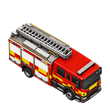 |  |
| 2 | Light 4X4 Pump (L4P) | 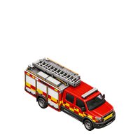 | 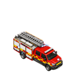 |
| 3 | Aerial Appliance | 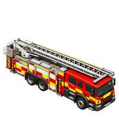 |  |
| 4 | Fire Officer | 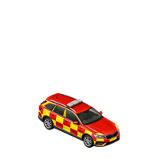 | 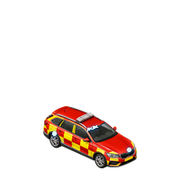 |
| 5 | Rescue Support Unit (RSU) | 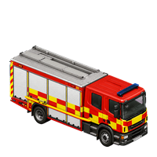 | 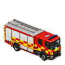 |
| 7 | Water Carrier | 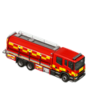 | 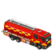 |
| 8 | HazMat Unit | 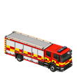 | 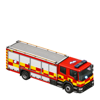 |
| 15 | BASU | 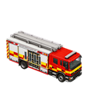 |  |
| 16 | ICCU | 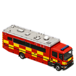 | 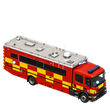 |
| 17 | Rescue Pump | 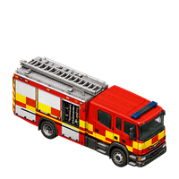 | 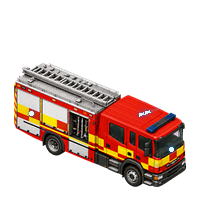 |
| 18 | CARP | 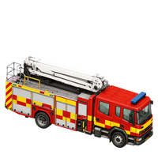 | 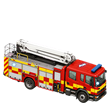 |
| 19 | Co-Responder Vehicle | 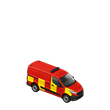 | 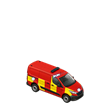 |
| 27 | Heavy 4x4 Tanker | 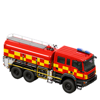 | 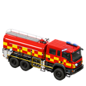 |
| 36 | BFU | 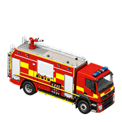 | 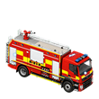 |
| 37 | F/WrC | 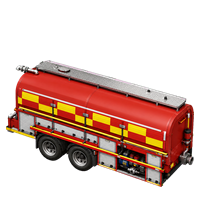 | 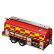 |
| 38 | WrL CAFS | 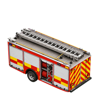 |  |
| 39 | RP CAFS | 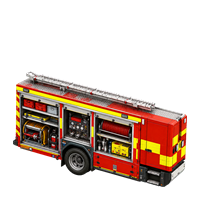 | 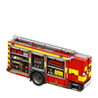 |
| 40 | OSU | 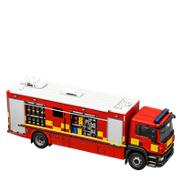 | 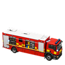 |
| 41 | PM | 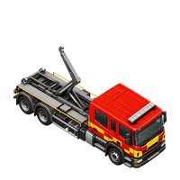 | 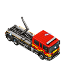 |
| 42 | Water Pod | 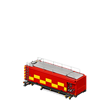 | 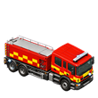 |
| 43 | Bulk Foam Pod | 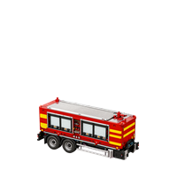 | 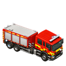 |
| 44 | Rescue Pod | 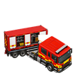 | 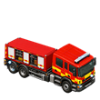 |
| 45 | Command Pod | 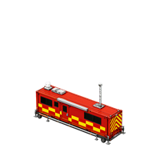 | 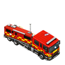 |
| 46 | Welfare Pod | 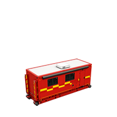 | 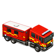 |
| 47 | BASU Pod |  | 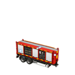 |
| 48 | Misting Pod | 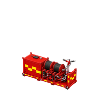 | 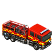 |
| 49 | Hazardous Materials Pod | 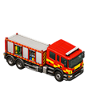 | 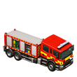 |
| 50 | OSU Pod | 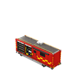 |  |
| 51 | HVP |  |  |
| 74 | Light 4x4 |  |  |
| 75 | Boat Trailer |  |  |
| 76 | Major Foam Tender |  |  |
| 77 | RIV |  |  |
| 78 | Airfield Firefighting Command Vehicle |  |  |
| 79 | Rescue Stairs |  |  |
| 91 | Drone Vehicle (Fire Station) |  |  |
| 108 | RRU |  |  |

## Ambulance

| Slot | Vehicle | Static | Animated |
| --- | --- | --- | --- |
| 6 | Ambulance |  |  |
| 10 | HEMS |  |  |
| 11 | RRV |  |  |
| 21 | OTL |  |  |
| 22 | General Practitioner |  |  |
| 23 | Community First Responder |  |  |
| 24 | Crew Carrier |  |  |
| 28 | PRV |  |  |
| 29 | SRV |  |  |
| 30 | Welfare Vehicle |  |  |
| 31 | ATV Carrier |  |  |
| 32 | Ambulance Control Unit |  |  |
| 33 | CBRN Vehicle |  |  |
| 34 | Mass Casualty Equipment |  |  |
| 35 | Ambulance Officer |  |  |
| 84 | Medical cycle responder |  |  |
| 95 | RRV |  |  |
| 96 | Community Midwife |  |  |
| 97 | Specialist Paramedic RRV |  |  |
| 98 | Patient Transport Service Ambulance |  |  |
| 99 | Critical Care Transfer Ambulance |  |  |

## Police

| Slot | Vehicle | Static | Animated |
| --- | --- | --- | --- |
| 9 | IRV |  |  |
| 12 | Police helicopter |  |  |
| 13 | DSU |  |  |
| 14 | ARV |  |  |
| 25 | Traffic Car |  |  |
| 26 | Armed Traffic Car |  |  |
| 52 | PSU Carrier |  |  |
| 53 | Firearms Personnel Carrier |  |  |
| 54 | Multiple Dog Carrier |  |  |
| 55 | Detention Van |  |  |
| 56 | Mounted Unit |  |  |
| 57 | M-RAV |  |  |
| 83 | Armed Cell Van |  |  |
| 92 | Drone Vehicle (Police Station) |  |  |
| 109 | EIU |  |  |
| 117 | Cell Van |  |  |

## Coastguard

| Slot | Vehicle | Static | Animated |
| --- | --- | --- | --- |
| 58 | CRV |  |  |
| 59 | Coastguard Mud Rescue Unit |  |  |
| 60 | Coastguard Rope Rescue Unit |  |  |
| 61 | Coastguard Commander |  |  |
| 62 | Flood Rescue Unit (Trailer) |  |  |
| 63 | Mud Decontamination Unit |  |  |
| 64 | Support Unit |  |  |
| 65 | Coastguard Rescue Helicopter |  |  |
| 66 | Coastguard Rescue Helicopter (Large) |  |  |
| 67 | 4x4 Vehicle |  |  |
| 68 | Inland Rescue Boat (Trailer) |  |  |

## Lifeboat

| Slot | Vehicle | Static | Animated |
| --- | --- | --- | --- |
| 69 | ILB |  |  |
| 70 | ALB |  |  |
| 71 | Rescue Watercraft (Trailer) |  |  |
| 72 | Hovercraft (Trailer) |  |  |
| 73 | Hovercraft Transporter |  |  |

## SAR

| Slot | Vehicle | Static | Animated |
| --- | --- | --- | --- |
| 85 | Pump Trailer |  |  |
| 86 | Control Van (SAR) |  |  |
| 87 | Operational Support Van |  |  |
| 88 | Operational Support Trailer |  |  |
| 89 | SAR Flood Rescue (Trailer) |  |  |
| 90 | Drone Vehicle (SAR HQ) |  |  |
| 93 | Personal SAR Vehicle |  |  |
| 94 | SAR 4x4 |  |  |
| 100 | Mountain Rescue 4x4 |  |  |
| 101 | Control Van (Mountain Rescue) |  |  |
| 102 | Search Dog Unit |  |  |
| 103 | Search Dog Unit (SAR) |  |  |
| 104 | Crew Carrier (SAR) |  |  |

## Recovery

| Slot | Vehicle | Static | Animated |
| --- | --- | --- | --- |
| 105 | Recovery Vehicle |  |  |
| 106 | Flatbed Recovery Vehicle |  |  |
| 107 | HGV Recovery Vehicle |  |  |

## Airfield

| Slot | Vehicle | Static | Animated |
| --- | --- | --- | --- |
| 80 | Airfield Operations Vehicle |  |  |
| 81 | Airfield Operations Supervisor |  |  |
| 82 | Medical equipment trailer |  |  |

## EOD

| Slot | Vehicle | Static | Animated |
| --- | --- | --- | --- |
| 110 | EOD Commander |  |  |
| 111 | EOD Response Vehicle |  |  |
| 112 | EOD Medium Equipment Van |  |  |
| 113 | EOD Heavy Equipment Vehicle |  |  |
| 114 | Marine EOD Response Vehicle |  |  |
| 115 | Marine EOD Equipment Van |  |  |

## Multi-service

| Slot | Vehicle | Static | Animated |
| --- | --- | --- | --- |
| 20 | Joint Response Unit |  |  |
| 116 | Welfare Vehicle |  |  |
