# Complete vehicle gallery

See all **117 static and animated vehicle graphics** included in **TKB UK Fleet — Animated** for MissionChief UK.

> **[Use TKB UK Fleet — Animated on MissionChief →](https://www.missionchief.co.uk/vehicle_graphics/5897)**

[MissionChief UK Guide](https://tkb-gaming.scot/games/missionchief/guides/) · [Scripts & Tools](https://tkb-gaming.scot/mission-chief-scripts/) · [Release downloads](https://github.com/Conroy1988/missionchief-uk-animated-graphics/releases/tag/v1.0.0)

The previews below use the pack's six-frame APNG files. Emergency vehicles animate with restrained alternating blue lights; vehicles that should not flash remain stable. Select any preview to open the full file.

## Core emergency services

<table>
  <tr>
    <td align="center" width="25%"><a href="assets/exports/standard/animated/fire-rescue-pump.png">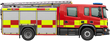</a> <strong>001 · Water Ladder</strong> <a href="assets/exports/standard/static/fire-rescue-pump.png">Static</a> · <a href="assets/exports/standard/animated/fire-rescue-pump.png">Animated</a></td>
    <td align="center" width="25%"><a href="assets/exports/standard/animated/light-4x4-pump.png">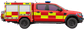</a> <strong>002 · Light 4X4 Pump (L4P)</strong> <a href="assets/exports/standard/static/light-4x4-pump.png">Static</a> · <a href="assets/exports/standard/animated/light-4x4-pump.png">Animated</a></td>
    <td align="center" width="25%"><a href="assets/exports/standard/animated/aerial-appliance.png">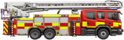</a> <strong>003 · Aerial Appliance</strong> <a href="assets/exports/standard/static/aerial-appliance.png">Static</a> · <a href="assets/exports/standard/animated/aerial-appliance.png">Animated</a></td>
    <td align="center" width="25%"> <strong>004 · Fire Officer</strong> <a href="assets/exports/standard/static/fire-officer.png">Static</a> · <a href="assets/exports/standard/animated/fire-officer.png">Animated</a></td>
  </tr>
  <tr>
    <td align="center" width="25%"><a href="assets/exports/standard/animated/rescue-support-unit.png">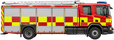</a> <strong>005 · Rescue Support Unit (RSU)</strong> <a href="assets/exports/standard/static/rescue-support-unit.png">Static</a> · <a href="assets/exports/standard/animated/rescue-support-unit.png">Animated</a></td>
    <td align="center" width="25%"> <strong>006 · Ambulance</strong> <a href="assets/exports/standard/static/frontline-ambulance.png">Static</a> · <a href="assets/exports/standard/animated/frontline-ambulance.png">Animated</a></td>
    <td align="center" width="25%"><a href="assets/exports/standard/animated/water-carrier.png">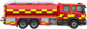</a> <strong>007 · Water Carrier</strong> <a href="assets/exports/standard/static/water-carrier.png">Static</a> · <a href="assets/exports/standard/animated/water-carrier.png">Animated</a></td>
    <td align="center" width="25%"><a href="assets/exports/standard/animated/hazmat-unit.png">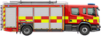</a> <strong>008 · HazMat Unit</strong> <a href="assets/exports/standard/static/hazmat-unit.png">Static</a> · <a href="assets/exports/standard/animated/hazmat-unit.png">Animated</a></td>
  </tr>
  <tr>
    <td align="center" width="25%"> <strong>009 · IRV</strong> <a href="assets/exports/standard/static/police-incident-response-vehicle.png">Static</a> · <a href="assets/exports/standard/animated/police-incident-response-vehicle.png">Animated</a></td>
    <td align="center" width="25%"><a href="assets/exports/standard/animated/hems.png">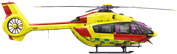</a> <strong>010 · HEMS</strong> <a href="assets/exports/standard/static/hems.png">Static</a> · <a href="assets/exports/standard/animated/hems.png">Animated</a></td>
    <td align="center" width="25%"> <strong>011 · RRV</strong> <a href="assets/exports/standard/static/rapid-response-vehicle.png">Static</a> · <a href="assets/exports/standard/animated/rapid-response-vehicle.png">Animated</a></td>
    <td align="center" width="25%"><a href="assets/exports/standard/animated/police-helicopter.png">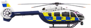</a> <strong>012 · Police helicopter</strong> <a href="assets/exports/standard/static/police-helicopter.png">Static</a> · <a href="assets/exports/standard/animated/police-helicopter.png">Animated</a></td>
  </tr>
  <tr>
    <td align="center" width="25%"> <strong>013 · DSU</strong> <a href="assets/exports/standard/static/dog-support-unit.png">Static</a> · <a href="assets/exports/standard/animated/dog-support-unit.png">Animated</a></td>
    <td align="center" width="25%"> <strong>014 · ARV</strong> <a href="assets/exports/standard/static/armed-response-vehicle.png">Static</a> · <a href="assets/exports/standard/animated/armed-response-vehicle.png">Animated</a></td>
    <td align="center" width="25%"><a href="assets/exports/standard/animated/breathing-apparatus-support-unit.png">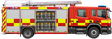</a> <strong>015 · BASU</strong> <a href="assets/exports/standard/static/breathing-apparatus-support-unit.png">Static</a> · <a href="assets/exports/standard/animated/breathing-apparatus-support-unit.png">Animated</a></td>
    <td align="center" width="25%"><a href="assets/exports/standard/animated/incident-command-control-unit.png">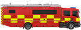</a> <strong>016 · ICCU</strong> <a href="assets/exports/standard/static/incident-command-control-unit.png">Static</a> · <a href="assets/exports/standard/animated/incident-command-control-unit.png">Animated</a></td>
  </tr>
  <tr>
    <td align="center" width="25%"><a href="assets/exports/standard/animated/rescue-pump.png">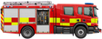</a> <strong>017 · Rescue Pump</strong> <a href="assets/exports/standard/static/rescue-pump.png">Static</a> · <a href="assets/exports/standard/animated/rescue-pump.png">Animated</a></td>
    <td align="center" width="25%"><a href="assets/exports/standard/animated/carp.png">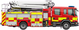</a> <strong>018 · CARP</strong> <a href="assets/exports/standard/static/carp.png">Static</a> · <a href="assets/exports/standard/animated/carp.png">Animated</a></td>
    <td align="center" width="25%"> <strong>019 · Co-Responder Vehicle</strong> <a href="assets/exports/standard/static/co-responder-vehicle.png">Static</a> · <a href="assets/exports/standard/animated/co-responder-vehicle.png">Animated</a></td>
    <td align="center" width="25%"> <strong>020 · Joint Response Unit</strong> <a href="assets/exports/standard/static/joint-response-unit.png">Static</a> · <a href="assets/exports/standard/animated/joint-response-unit.png">Animated</a></td>
  </tr>
  <tr>
    <td align="center" width="25%"> <strong>021 · OTL</strong> <a href="assets/exports/standard/static/otl.png">Static</a> · <a href="assets/exports/standard/animated/otl.png">Animated</a></td>
    <td align="center" width="25%"> <strong>022 · General Practitioner</strong> <a href="assets/exports/standard/static/general-practitioner.png">Static</a> · <a href="assets/exports/standard/animated/general-practitioner.png">Animated</a></td>
    <td align="center" width="25%"> <strong>023 · Community First Responder</strong> <a href="assets/exports/standard/static/community-first-responder.png">Static</a> · <a href="assets/exports/standard/animated/community-first-responder.png">Animated</a></td>
    <td align="center" width="25%"> <strong>024 · Crew Carrier</strong> <a href="assets/exports/standard/static/crew-carrier.png">Static</a> · <a href="assets/exports/standard/animated/crew-carrier.png">Animated</a></td>
  </tr>
  <tr>
    <td align="center" width="25%"> <strong>025 · Traffic Car</strong> <a href="assets/exports/standard/static/traffic-car.png">Static</a> · <a href="assets/exports/standard/animated/traffic-car.png">Animated</a></td>
    <td align="center" width="25%"> <strong>026 · Armed Traffic Car</strong> <a href="assets/exports/standard/static/armed-traffic-car.png">Static</a> · <a href="assets/exports/standard/animated/armed-traffic-car.png">Animated</a></td>
    <td align="center" width="25%"><a href="assets/exports/standard/animated/heavy-4x4-tanker.png">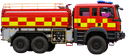</a> <strong>027 · Heavy 4x4 Tanker</strong> <a href="assets/exports/standard/static/heavy-4x4-tanker.png">Static</a> · <a href="assets/exports/standard/animated/heavy-4x4-tanker.png">Animated</a></td>
    <td align="center" width="25%"> <strong>028 · PRV</strong> <a href="assets/exports/standard/static/prv.png">Static</a> · <a href="assets/exports/standard/animated/prv.png">Animated</a></td>
  </tr>
  <tr>
    <td align="center" width="25%"> <strong>029 · SRV</strong> <a href="assets/exports/standard/static/srv.png">Static</a> · <a href="assets/exports/standard/animated/srv.png">Animated</a></td>
    <td align="center" width="25%"> <strong>030 · Welfare Vehicle</strong> <a href="assets/exports/standard/static/welfare-vehicle.png">Static</a> · <a href="assets/exports/standard/animated/welfare-vehicle.png">Animated</a></td>
    <td align="center" width="25%"><a href="assets/exports/standard/animated/atv-carrier.png">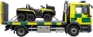</a> <strong>031 · ATV Carrier</strong> <a href="assets/exports/standard/static/atv-carrier.png">Static</a> · <a href="assets/exports/standard/animated/atv-carrier.png">Animated</a></td>
    <td align="center" width="25%"> <strong>032 · Ambulance Control Unit</strong> <a href="assets/exports/standard/static/ambulance-control-unit.png">Static</a> · <a href="assets/exports/standard/animated/ambulance-control-unit.png">Animated</a></td>
  </tr>
  <tr>
    <td align="center" width="25%"> <strong>033 · CBRN Vehicle</strong> <a href="assets/exports/standard/static/cbrn-vehicle.png">Static</a> · <a href="assets/exports/standard/animated/cbrn-vehicle.png">Animated</a></td>
    <td align="center" width="25%"> <strong>034 · Mass Casualty Equipment</strong> <a href="assets/exports/standard/static/mass-casualty-equipment.png">Static</a> · <a href="assets/exports/standard/animated/mass-casualty-equipment.png">Animated</a></td>
    <td align="center" width="25%"> <strong>035 · Ambulance Officer</strong> <a href="assets/exports/standard/static/ambulance-officer.png">Static</a> · <a href="assets/exports/standard/animated/ambulance-officer.png">Animated</a></td>
    <td width="25%"></td>
  </tr>
</table>

## Fire specialist vehicles and pods

<table>
  <tr>
    <td align="center" width="25%"><a href="assets/exports/standard/animated/bfu.png">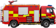</a> <strong>036 · BFU</strong> <a href="assets/exports/standard/static/bfu.png">Static</a> · <a href="assets/exports/standard/animated/bfu.png">Animated</a></td>
    <td align="center" width="25%"><a href="assets/exports/standard/animated/f-wrc.png">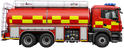</a> <strong>037 · F/WrC</strong> <a href="assets/exports/standard/static/f-wrc.png">Static</a> · <a href="assets/exports/standard/animated/f-wrc.png">Animated</a></td>
    <td align="center" width="25%"><a href="assets/exports/standard/animated/wrl-cafs.png">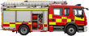</a> <strong>038 · WrL CAFS</strong> <a href="assets/exports/standard/static/wrl-cafs.png">Static</a> · <a href="assets/exports/standard/animated/wrl-cafs.png">Animated</a></td>
    <td align="center" width="25%"><a href="assets/exports/standard/animated/rp-cafs.png">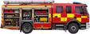</a> <strong>039 · RP CAFS</strong> <a href="assets/exports/standard/static/rp-cafs.png">Static</a> · <a href="assets/exports/standard/animated/rp-cafs.png">Animated</a></td>
  </tr>
  <tr>
    <td align="center" width="25%"><a href="assets/exports/standard/animated/osu.png">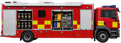</a> <strong>040 · OSU</strong> <a href="assets/exports/standard/static/osu.png">Static</a> · <a href="assets/exports/standard/animated/osu.png">Animated</a></td>
    <td align="center" width="25%"><a href="assets/exports/standard/animated/pm.png">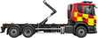</a> <strong>041 · PM</strong> <a href="assets/exports/standard/static/pm.png">Static</a> · <a href="assets/exports/standard/animated/pm.png">Animated</a></td>
    <td align="center" width="25%"><a href="assets/exports/standard/animated/water-pod.png">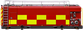</a> <strong>042 · Water Pod</strong> <a href="assets/exports/standard/static/water-pod.png">Static</a> · <a href="assets/exports/standard/animated/water-pod.png">Animated</a></td>
    <td align="center" width="25%"><a href="assets/exports/standard/animated/bulk-foam-pod.png">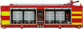</a> <strong>043 · Bulk Foam Pod</strong> <a href="assets/exports/standard/static/bulk-foam-pod.png">Static</a> · <a href="assets/exports/standard/animated/bulk-foam-pod.png">Animated</a></td>
  </tr>
  <tr>
    <td align="center" width="25%"><a href="assets/exports/standard/animated/rescue-pod.png">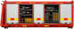</a> <strong>044 · Rescue Pod</strong> <a href="assets/exports/standard/static/rescue-pod.png">Static</a> · <a href="assets/exports/standard/animated/rescue-pod.png">Animated</a></td>
    <td align="center" width="25%"><a href="assets/exports/standard/animated/command-pod.png">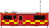</a> <strong>045 · Command Pod</strong> <a href="assets/exports/standard/static/command-pod.png">Static</a> · <a href="assets/exports/standard/animated/command-pod.png">Animated</a></td>
    <td align="center" width="25%"><a href="assets/exports/standard/animated/welfare-pod.png">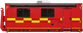</a> <strong>046 · Welfare Pod</strong> <a href="assets/exports/standard/static/welfare-pod.png">Static</a> · <a href="assets/exports/standard/animated/welfare-pod.png">Animated</a></td>
    <td align="center" width="25%"><a href="assets/exports/standard/animated/basu-pod.png">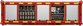</a> <strong>047 · BASU Pod</strong> <a href="assets/exports/standard/static/basu-pod.png">Static</a> · <a href="assets/exports/standard/animated/basu-pod.png">Animated</a></td>
  </tr>
  <tr>
    <td align="center" width="25%"> <strong>048 · Misting Pod</strong> <a href="assets/exports/standard/static/misting-pod.png">Static</a> · <a href="assets/exports/standard/animated/misting-pod.png">Animated</a></td>
    <td align="center" width="25%"> <strong>049 · Hazardous Materials Pod</strong> <a href="assets/exports/standard/static/hazardous-materials-pod.png">Static</a> · <a href="assets/exports/standard/animated/hazardous-materials-pod.png">Animated</a></td>
    <td align="center" width="25%"> <strong>050 · OSU Pod</strong> <a href="assets/exports/standard/static/osu-pod.png">Static</a> · <a href="assets/exports/standard/animated/osu-pod.png">Animated</a></td>
    <td align="center" width="25%"><a href="assets/exports/standard/animated/hvp.png">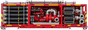</a> <strong>051 · HVP</strong> <a href="assets/exports/standard/static/hvp.png">Static</a> · <a href="assets/exports/standard/animated/hvp.png">Animated</a></td>
  </tr>
</table>

## Police specialist fleet

<table>
  <tr>
    <td align="center" width="25%"> <strong>052 · PSU Carrier</strong> <a href="assets/exports/standard/static/psu-carrier.png">Static</a> · <a href="assets/exports/standard/animated/psu-carrier.png">Animated</a></td>
    <td align="center" width="25%"> <strong>053 · Firearms Personnel Carrier</strong> <a href="assets/exports/standard/static/firearms-personnel-carrier.png">Static</a> · <a href="assets/exports/standard/animated/firearms-personnel-carrier.png">Animated</a></td>
    <td align="center" width="25%"> <strong>054 · Multiple Dog Carrier</strong> <a href="assets/exports/standard/static/multiple-dog-carrier.png">Static</a> · <a href="assets/exports/standard/animated/multiple-dog-carrier.png">Animated</a></td>
    <td align="center" width="25%"> <strong>055 · Detention Van</strong> <a href="assets/exports/standard/static/detention-van.png">Static</a> · <a href="assets/exports/standard/animated/detention-van.png">Animated</a></td>
  </tr>
  <tr>
    <td align="center" width="25%"> <strong>056 · Mounted Unit</strong> <a href="assets/exports/standard/static/mounted-unit.png">Static</a> · <a href="assets/exports/standard/animated/mounted-unit.png">Animated</a></td>
    <td align="center" width="25%"><a href="assets/exports/standard/animated/m-rav.png">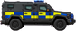</a> <strong>057 · M-RAV</strong> <a href="assets/exports/standard/static/m-rav.png">Static</a> · <a href="assets/exports/standard/animated/m-rav.png">Animated</a></td>
    <td align="center" width="25%"> <strong>058 · CRV</strong> <a href="assets/exports/standard/static/crv.png">Static</a> · <a href="assets/exports/standard/animated/crv.png">Animated</a></td>
    <td width="25%"></td>
  </tr>
</table>

## Coastguard, RNLI and water rescue

<table>
  <tr>
    <td align="center" width="25%"> <strong>059 · Coastguard Mud Rescue Unit</strong> <a href="assets/exports/standard/static/coastguard-mud-rescue-unit.png">Static</a> · <a href="assets/exports/standard/animated/coastguard-mud-rescue-unit.png">Animated</a></td>
    <td align="center" width="25%"> <strong>060 · Coastguard Rope Rescue Unit</strong> <a href="assets/exports/standard/static/coastguard-rope-rescue-unit.png">Static</a> · <a href="assets/exports/standard/animated/coastguard-rope-rescue-unit.png">Animated</a></td>
    <td align="center" width="25%"><a href="assets/exports/standard/animated/coastguard-commander.png">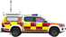</a> <strong>061 · Coastguard Commander</strong> <a href="assets/exports/standard/static/coastguard-commander.png">Static</a> · <a href="assets/exports/standard/animated/coastguard-commander.png">Animated</a></td>
    <td align="center" width="25%"><a href="assets/exports/standard/animated/flood-rescue-unit-trailer.png">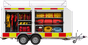</a> <strong>062 · Flood Rescue Unit (Trailer)</strong> <a href="assets/exports/standard/static/flood-rescue-unit-trailer.png">Static</a> · <a href="assets/exports/standard/animated/flood-rescue-unit-trailer.png">Animated</a></td>
  </tr>
  <tr>
    <td align="center" width="25%"> <strong>063 · Mud Decontamination Unit</strong> <a href="assets/exports/standard/static/mud-decontamination-unit.png">Static</a> · <a href="assets/exports/standard/animated/mud-decontamination-unit.png">Animated</a></td>
    <td align="center" width="25%"><a href="assets/exports/standard/animated/support-unit.png">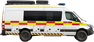</a> <strong>064 · Support Unit</strong> <a href="assets/exports/standard/static/support-unit.png">Static</a> · <a href="assets/exports/standard/animated/support-unit.png">Animated</a></td>
    <td align="center" width="25%"><a href="assets/exports/standard/animated/coastguard-rescue-helicopter.png">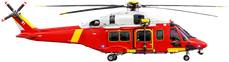</a> <strong>065 · Coastguard Rescue Helicopter</strong> <a href="assets/exports/standard/static/coastguard-rescue-helicopter.png">Static</a> · <a href="assets/exports/standard/animated/coastguard-rescue-helicopter.png">Animated</a></td>
    <td align="center" width="25%"><a href="assets/exports/standard/animated/coastguard-rescue-helicopter-large.png">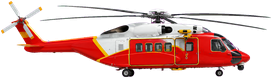</a> <strong>066 · Coastguard Rescue Helicopter (Large)</strong> <a href="assets/exports/standard/static/coastguard-rescue-helicopter-large.png">Static</a> · <a href="assets/exports/standard/animated/coastguard-rescue-helicopter-large.png">Animated</a></td>
  </tr>
  <tr>
    <td align="center" width="25%"> <strong>067 · 4x4 Vehicle</strong> <a href="assets/exports/standard/static/4x4-vehicle.png">Static</a> · <a href="assets/exports/standard/animated/4x4-vehicle.png">Animated</a></td>
    <td align="center" width="25%"><a href="assets/exports/standard/animated/inland-rescue-boat-trailer.png">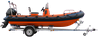</a> <strong>068 · Inland Rescue Boat (Trailer)</strong> <a href="assets/exports/standard/static/inland-rescue-boat-trailer.png">Static</a> · <a href="assets/exports/standard/animated/inland-rescue-boat-trailer.png">Animated</a></td>
    <td align="center" width="25%"> <strong>069 · ILB</strong> <a href="assets/exports/standard/static/ilb.png">Static</a> · <a href="assets/exports/standard/animated/ilb.png">Animated</a></td>
    <td align="center" width="25%"><a href="assets/exports/standard/animated/alb.png">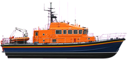</a> <strong>070 · ALB</strong> <a href="assets/exports/standard/static/alb.png">Static</a> · <a href="assets/exports/standard/animated/alb.png">Animated</a></td>
  </tr>
  <tr>
    <td align="center" width="25%"> <strong>071 · Rescue Watercraft (Trailer)</strong> <a href="assets/exports/standard/static/rescue-watercraft-trailer.png">Static</a> · <a href="assets/exports/standard/animated/rescue-watercraft-trailer.png">Animated</a></td>
    <td align="center" width="25%"><a href="assets/exports/standard/animated/hovercraft-trailer.png">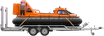</a> <strong>072 · Hovercraft (Trailer)</strong> <a href="assets/exports/standard/static/hovercraft-trailer.png">Static</a> · <a href="assets/exports/standard/animated/hovercraft-trailer.png">Animated</a></td>
    <td align="center" width="25%"> <strong>073 · Hovercraft Transporter</strong> <a href="assets/exports/standard/static/hovercraft-transporter.png">Static</a> · <a href="assets/exports/standard/animated/hovercraft-transporter.png">Animated</a></td>
    <td align="center" width="25%"> <strong>074 · Light 4x4</strong> <a href="assets/exports/standard/static/light-4x4.png">Static</a> · <a href="assets/exports/standard/animated/light-4x4.png">Animated</a></td>
  </tr>
  <tr>
    <td align="center" width="25%"><a href="assets/exports/standard/animated/boat-trailer.png">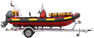</a> <strong>075 · Boat Trailer</strong> <a href="assets/exports/standard/static/boat-trailer.png">Static</a> · <a href="assets/exports/standard/animated/boat-trailer.png">Animated</a></td>
    <td width="25%"></td>
    <td width="25%"></td>
    <td width="25%"></td>
  </tr>
</table>

## Airfield and specialist response

<table>
  <tr>
    <td align="center" width="25%"><a href="assets/exports/standard/animated/major-foam-tender.png">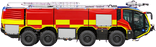</a> <strong>076 · Major Foam Tender</strong> <a href="assets/exports/standard/static/major-foam-tender.png">Static</a> · <a href="assets/exports/standard/animated/major-foam-tender.png">Animated</a></td>
    <td align="center" width="25%"><a href="assets/exports/standard/animated/riv.png">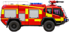</a> <strong>077 · RIV</strong> <a href="assets/exports/standard/static/riv.png">Static</a> · <a href="assets/exports/standard/animated/riv.png">Animated</a></td>
    <td align="center" width="25%"><a href="assets/exports/standard/animated/airfield-firefighting-command-vehicle.png">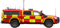</a> <strong>078 · Airfield Firefighting Command Vehicle</strong> <a href="assets/exports/standard/static/airfield-firefighting-command-vehicle.png">Static</a> · <a href="assets/exports/standard/animated/airfield-firefighting-command-vehicle.png">Animated</a></td>
    <td align="center" width="25%"><a href="assets/exports/standard/animated/rescue-stairs.png">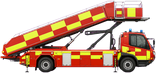</a> <strong>079 · Rescue Stairs</strong> <a href="assets/exports/standard/static/rescue-stairs.png">Static</a> · <a href="assets/exports/standard/animated/rescue-stairs.png">Animated</a></td>
  </tr>
  <tr>
    <td align="center" width="25%"><a href="assets/exports/standard/animated/airfield-operations-vehicle.png">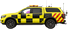</a> <strong>080 · Airfield Operations Vehicle</strong> <a href="assets/exports/standard/static/airfield-operations-vehicle.png">Static</a> · <a href="assets/exports/standard/animated/airfield-operations-vehicle.png">Animated</a></td>
    <td align="center" width="25%"><a href="assets/exports/standard/animated/airfield-operations-supervisor.png">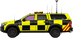</a> <strong>081 · Airfield Operations Supervisor</strong> <a href="assets/exports/standard/static/airfield-operations-supervisor.png">Static</a> · <a href="assets/exports/standard/animated/airfield-operations-supervisor.png">Animated</a></td>
    <td align="center" width="25%"><a href="assets/exports/standard/animated/medical-equipment-trailer.png">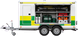</a> <strong>082 · Medical equipment trailer</strong> <a href="assets/exports/standard/static/medical-equipment-trailer.png">Static</a> · <a href="assets/exports/standard/animated/medical-equipment-trailer.png">Animated</a></td>
    <td align="center" width="25%"> <strong>083 · Armed Cell Van</strong> <a href="assets/exports/standard/static/armed-cell-van.png">Static</a> · <a href="assets/exports/standard/animated/armed-cell-van.png">Animated</a></td>
  </tr>
</table>

## Search and rescue and medical expansion

<table>
  <tr>
    <td align="center" width="25%"> <strong>084 · Medical cycle responder</strong> <a href="assets/exports/standard/static/medical-cycle-responder.png">Static</a> · <a href="assets/exports/standard/animated/medical-cycle-responder.png">Animated</a></td>
    <td align="center" width="25%"> <strong>085 · Pump Trailer</strong> <a href="assets/exports/standard/static/pump-trailer.png">Static</a> · <a href="assets/exports/standard/animated/pump-trailer.png">Animated</a></td>
    <td align="center" width="25%"> <strong>086 · Control Van (SAR)</strong> <a href="assets/exports/standard/static/control-van-sar.png">Static</a> · <a href="assets/exports/standard/animated/control-van-sar.png">Animated</a></td>
    <td align="center" width="25%"> <strong>087 · Operational Support Van</strong> <a href="assets/exports/standard/static/operational-support-van.png">Static</a> · <a href="assets/exports/standard/animated/operational-support-van.png">Animated</a></td>
  </tr>
  <tr>
    <td align="center" width="25%"><a href="assets/exports/standard/animated/operational-support-trailer.png">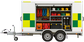</a> <strong>088 · Operational Support Trailer</strong> <a href="assets/exports/standard/static/operational-support-trailer.png">Static</a> · <a href="assets/exports/standard/animated/operational-support-trailer.png">Animated</a></td>
    <td align="center" width="25%"><a href="assets/exports/standard/animated/sar-flood-rescue-trailer.png">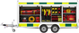</a> <strong>089 · SAR Flood Rescue (Trailer)</strong> <a href="assets/exports/standard/static/sar-flood-rescue-trailer.png">Static</a> · <a href="assets/exports/standard/animated/sar-flood-rescue-trailer.png">Animated</a></td>
    <td align="center" width="25%"> <strong>090 · Drone Vehicle (SAR HQ)</strong> <a href="assets/exports/standard/static/drone-vehicle-sar-hq.png">Static</a> · <a href="assets/exports/standard/animated/drone-vehicle-sar-hq.png">Animated</a></td>
    <td align="center" width="25%"><a href="assets/exports/standard/animated/drone-vehicle-fire-station.png">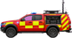</a> <strong>091 · Drone Vehicle (Fire Station)</strong> <a href="assets/exports/standard/static/drone-vehicle-fire-station.png">Static</a> · <a href="assets/exports/standard/animated/drone-vehicle-fire-station.png">Animated</a></td>
  </tr>
  <tr>
    <td align="center" width="25%"><a href="assets/exports/standard/animated/drone-vehicle-police-station.png">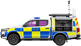</a> <strong>092 · Drone Vehicle (Police Station)</strong> <a href="assets/exports/standard/static/drone-vehicle-police-station.png">Static</a> · <a href="assets/exports/standard/animated/drone-vehicle-police-station.png">Animated</a></td>
    <td align="center" width="25%"> <strong>093 · Personal SAR Vehicle</strong> <a href="assets/exports/standard/static/personal-sar-vehicle.png">Static</a> · <a href="assets/exports/standard/animated/personal-sar-vehicle.png">Animated</a></td>
    <td align="center" width="25%"> <strong>094 · SAR 4x4</strong> <a href="assets/exports/standard/static/sar-4x4.png">Static</a> · <a href="assets/exports/standard/animated/sar-4x4.png">Animated</a></td>
    <td align="center" width="25%"> <strong>095 · RRV</strong> <a href="assets/exports/standard/static/rrv-2.png">Static</a> · <a href="assets/exports/standard/animated/rrv-2.png">Animated</a></td>
  </tr>
  <tr>
    <td align="center" width="25%"> <strong>096 · Community Midwife</strong> <a href="assets/exports/standard/static/community-midwife.png">Static</a> · <a href="assets/exports/standard/animated/community-midwife.png">Animated</a></td>
    <td align="center" width="25%"> <strong>097 · Specialist Paramedic RRV</strong> <a href="assets/exports/standard/static/specialist-paramedic-rrv.png">Static</a> · <a href="assets/exports/standard/animated/specialist-paramedic-rrv.png">Animated</a></td>
    <td align="center" width="25%"> <strong>098 · Patient Transport Service Ambulance</strong> <a href="assets/exports/standard/static/patient-transport-service-ambulance.png">Static</a> · <a href="assets/exports/standard/animated/patient-transport-service-ambulance.png">Animated</a></td>
    <td align="center" width="25%"> <strong>099 · Critical Care Transfer Ambulance</strong> <a href="assets/exports/standard/static/critical-care-transfer-ambulance.png">Static</a> · <a href="assets/exports/standard/animated/critical-care-transfer-ambulance.png">Animated</a></td>
  </tr>
  <tr>
    <td align="center" width="25%"><a href="assets/exports/standard/animated/mountain-rescue-4x4.png">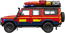</a> <strong>100 · Mountain Rescue 4x4</strong> <a href="assets/exports/standard/static/mountain-rescue-4x4.png">Static</a> · <a href="assets/exports/standard/animated/mountain-rescue-4x4.png">Animated</a></td>
    <td align="center" width="25%"><a href="assets/exports/standard/animated/control-van-mountain-rescue.png">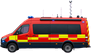</a> <strong>101 · Control Van (Mountain Rescue)</strong> <a href="assets/exports/standard/static/control-van-mountain-rescue.png">Static</a> · <a href="assets/exports/standard/animated/control-van-mountain-rescue.png">Animated</a></td>
    <td align="center" width="25%"> <strong>102 · Search Dog Unit</strong> <a href="assets/exports/standard/static/search-dog-unit.png">Static</a> · <a href="assets/exports/standard/animated/search-dog-unit.png">Animated</a></td>
    <td align="center" width="25%"> <strong>103 · Search Dog Unit (SAR)</strong> <a href="assets/exports/standard/static/search-dog-unit-sar.png">Static</a> · <a href="assets/exports/standard/animated/search-dog-unit-sar.png">Animated</a></td>
  </tr>
  <tr>
    <td align="center" width="25%"> <strong>104 · Crew Carrier (SAR)</strong> <a href="assets/exports/standard/static/crew-carrier-sar.png">Static</a> · <a href="assets/exports/standard/animated/crew-carrier-sar.png">Animated</a></td>
    <td width="25%"></td>
    <td width="25%"></td>
    <td width="25%"></td>
  </tr>
</table>

## Recovery vehicles

<table>
  <tr>
    <td align="center" width="25%"> <strong>105 · Recovery Vehicle</strong> <a href="assets/exports/standard/static/recovery-vehicle.png">Static</a> · <a href="assets/exports/standard/animated/recovery-vehicle.png">Animated</a></td>
    <td align="center" width="25%"> <strong>106 · Flatbed Recovery Vehicle</strong> <a href="assets/exports/standard/static/flatbed-recovery-vehicle.png">Static</a> · <a href="assets/exports/standard/animated/flatbed-recovery-vehicle.png">Animated</a></td>
    <td align="center" width="25%"> <strong>107 · HGV Recovery Vehicle</strong> <a href="assets/exports/standard/static/hgv-recovery-vehicle.png">Static</a> · <a href="assets/exports/standard/animated/hgv-recovery-vehicle.png">Animated</a></td>
    <td width="25%"></td>
  </tr>
</table>

## Rail, EOD and custody expansion

<table>
  <tr>
    <td align="center" width="25%"> <strong>108 · RRU</strong> <a href="assets/exports/standard/static/rru.png">Static</a> · <a href="assets/exports/standard/animated/rru.png">Animated</a></td>
    <td align="center" width="25%"> <strong>109 · EIU</strong> <a href="assets/exports/standard/static/eiu.png">Static</a> · <a href="assets/exports/standard/animated/eiu.png">Animated</a></td>
    <td align="center" width="25%"> <strong>110 · EOD Commander</strong> <a href="assets/exports/standard/static/eod-commander.png">Static</a> · <a href="assets/exports/standard/animated/eod-commander.png">Animated</a></td>
    <td align="center" width="25%"> <strong>111 · EOD Response Vehicle</strong> <a href="assets/exports/standard/static/eod-response-vehicle.png">Static</a> · <a href="assets/exports/standard/animated/eod-response-vehicle.png">Animated</a></td>
  </tr>
  <tr>
    <td align="center" width="25%"> <strong>112 · EOD Medium Equipment Van</strong> <a href="assets/exports/standard/static/eod-medium-equipment-van.png">Static</a> · <a href="assets/exports/standard/animated/eod-medium-equipment-van.png">Animated</a></td>
    <td align="center" width="25%"> <strong>113 · EOD Heavy Equipment Vehicle</strong> <a href="assets/exports/standard/static/eod-heavy-equipment-vehicle.png">Static</a> · <a href="assets/exports/standard/animated/eod-heavy-equipment-vehicle.png">Animated</a></td>
    <td align="center" width="25%"> <strong>114 · Marine EOD Response Vehicle</strong> <a href="assets/exports/standard/static/marine-eod-response-vehicle.png">Static</a> · <a href="assets/exports/standard/animated/marine-eod-response-vehicle.png">Animated</a></td>
    <td align="center" width="25%"> <strong>115 · Marine EOD Equipment Van</strong> <a href="assets/exports/standard/static/marine-eod-equipment-van.png">Static</a> · <a href="assets/exports/standard/animated/marine-eod-equipment-van.png">Animated</a></td>
  </tr>
  <tr>
    <td align="center" width="25%"> <strong>116 · Welfare Vehicle</strong> <a href="assets/exports/standard/static/welfare-vehicle-2.png">Static</a> · <a href="assets/exports/standard/animated/welfare-vehicle-2.png">Animated</a></td>
    <td align="center" width="25%"> <strong>117 · Cell Van</strong> <a href="assets/exports/standard/static/cell-van.png">Static</a> · <a href="assets/exports/standard/animated/cell-van.png">Animated</a></td>
    <td width="25%"></td>
    <td width="25%"></td>
  </tr>
</table>

---

Want to use the complete fleet? **[Open the public MissionChief graphics pack](https://www.missionchief.co.uk/vehicle_graphics/5897)** and select it for your account.
