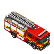
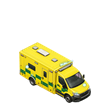
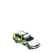
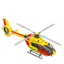
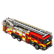
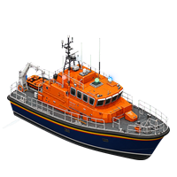
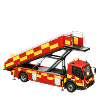
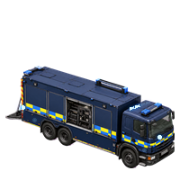
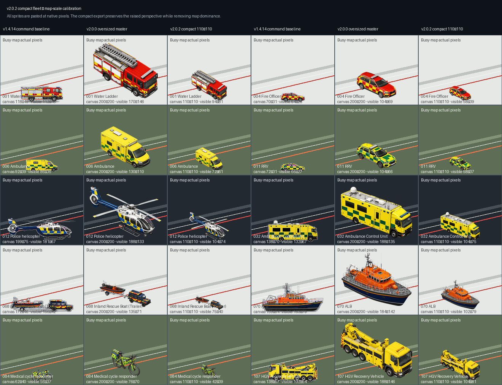

# TKB UK Emergency Fleet — Calibrated Helicopter Motion v2.0.2

A complete original UK emergency-services vehicle graphics pack for [MissionChief UK](https://www.missionchief.co.uk/), built by **TKB Gaming**.

> **[Use TKB UK Fleet — Animated on MissionChief →](https://www.missionchief.co.uk/vehicle_graphics/5897)**

> **[Explore all 117 v2 vehicles in the interactive gallery →](https://tkb-gaming.scot/games/missionchief/guides/fleet-gallery/)**

## The v2 fleet

Version 2 rebuilds all **117 current MissionChief UK vehicle slots** around one fixed raised three-quarter camera. Every subject points diagonally toward the lower-right, so MissionChief can move the same native sprite left or right without making the artwork look backwards.

<table>
  <tr>
    <td align="center" width="25%"><br><strong>Water Ladder</strong></td>
    <td align="center" width="25%"><br><strong>Ambulance</strong></td>
    <td align="center" width="25%"><br><strong>Police IRV</strong></td>
    <td align="center" width="25%"><br><strong>HEMS</strong></td>
  </tr>
  <tr>
    <td align="center" width="25%"><br><strong>Aerial Appliance</strong></td>
    <td align="center" width="25%"><br><strong>ALB</strong></td>
    <td align="center" width="25%"><br><strong>Rescue Stairs</strong></td>
    <td align="center" width="25%"><br><strong>Heavy EOD</strong></td>
  </tr>
</table>

The complete set contains:

- 117 transparent 110×110 map-calibrated static PNGs, derived from preserved 200×200 masters;
- 117 lossless, infinitely looping response APNGs;
- 111 twelve-frame road, pod, trailer, cycle and specialist animations;
- six eighteen-frame aircraft and marine animations;
- exact one-to-one parity with the authoritative MissionChief slot order;
- a numbered upload package with byte-verified static and animated folders.

## Visual standard

- Raised three-quarter top-down artwork exposes roof equipment, lightbars, carried loads, rotors and marine superstructure.
- Every sprite keeps the same lower-right orientation; no browser script, Toolkit feature or direction detector is required.
- Real-world length drives relative scale, with class-specific optical limits for cars, vans, heavy appliances, pods, trailers, aircraft, watercraft and the medical cycle.
- Complete towing combinations remain a single connected graphic where MissionChief dispatches the slot as one moving object.
- Role-defining UK livery and equipment are preserved without copying registrations, protected service logos or manufacturer branding.

The full production contract is documented in [docs/V2_DIRECTION_NEUTRAL_STANDARD.md](docs/V2_DIRECTION_NEUTRAL_STANDARD.md).

## Emergency lighting

Response lighting is deliberately unmistakable at map scale. Each animated fixture combines a bright physical lens, compact inner flare and restrained outer bloom. Separate A/B fixture groups run an alternating double-flash cycle instead of making the whole fleet pulse in unison.

- Blue response profiles cover emergency road vehicles, specialist units, pods and towing combinations.
- Green response lighting is used for the General Practitioner vehicle.
- Amber profiles cover recovery and selected airfield assets.
- Aircraft use blue response lamps, red/green navigation lighting, white strobes and aircraft-specific rotor motion.
- ILB and ALB use blue response lamps, navigation lighting and restrained wake motion.

Every response asset is checked at native 110×110 map scale, 75% and 50% display scale. The release gate rejects a flash that is too small or too dim, a lamp core that floats off the subject, oversized effects, partial APNG update tiles, unsupported frame blending, invalid timing or a non-looping file.

## Helicopter rotor motion

Version 2.0.2 replaces the stopped, cross-shaped helicopter blades with calibrated high-RPM animation on HEMS, Police and both Coastguard aircraft. Each airframe has an explicit main hub, rotor-disc footprint and tail-rotor centre instead of estimating rotor placement from the whole-aircraft bounding box.

- HEMS and Police tail motion is clipped inside the physical fenestron opening.
- Both Coastguard tail rotors turn around their exposed mechanical hubs.
- Main-rotor discs preserve the perspective, diameter and blade count implied by each source aircraft.
- Blade-free production bases are repaired beneath every sweep so no frozen rotor or erased fuselage leaks into the animation.

**[Four-aircraft rotor preview](assets/previews/v2.0.2/helicopter-rotor-fleet.gif)** · **[Tail-rotor alignment audit](assets/previews/v2.0.2/helicopter-tail-rotor-alignment.gif)**

## Tested for real map conditions

All 117 static and all 117 animated assets are rendered and inspected against light, dark, grayscale and satellite-style backgrounds in both alternating flash phases.

[](assets/previews/v2.0.2/compact-map-scale-calibration.png)

**[Static light-map audit](assets/previews/v2.0.2/full-fleet-static-light.png)** · **[Static satellite audit](assets/previews/v2.0.2/full-fleet-static-satellite.png)** · **[Response phase B dark-map audit](assets/previews/v2.0.2/full-fleet-response-b-dark.png)** · **[Response grayscale audit](assets/previews/v2.0.2/full-fleet-response-a-grayscale.png)**

The machine-readable gates report:

- static QA: 117/117 passed;
- animation QA: 117/117 passed;
- APNG distribution: 111×12 frames and 6×18 frames;
- numbered deployment package: 117 static + 117 animated files;
- current v1.4.14 command exports unchanged during the isolated rebuild.

## Install in MissionChief

1. Open [TKB UK Fleet — Animated](https://www.missionchief.co.uk/vehicle_graphics/5897).
2. Select the graphics pack for your MissionChief account.
3. Enable animated vehicle graphics to use the response APNGs.

The game renders every v2 asset natively. No secondary extension or userscript is required by players.

## Release download

The [v2.0.2 release](https://github.com/Conroy1988/missionchief-uk-animated-graphics/releases/tag/v2.0.2) includes:

- `TKB-UK-Emergency-Fleet-Direction-Neutral-MissionChief-Numbered-Upload-Ready-v2.0.2.zip` — ordered static/animated deployment folders, exact slot guide, machine-readable manifest and SHA-256 verification;
- `v2.0.2-scale-report.json`, static/animation QA, rotor geometry, fixture metadata and complete integrity report — production evidence for every vehicle and animation.

The [v2.0.1 release](https://github.com/Conroy1988/missionchief-uk-animated-graphics/releases/tag/v2.0.1) retains the original compact-scale rotor animation. The [v2.0.0 release](https://github.com/Conroy1988/missionchief-uk-animated-graphics/releases/tag/v2.0.0) retains the original 200×200 direction-neutral exports. The [v1.4.14 release](https://github.com/Conroy1988/missionchief-uk-animated-graphics/releases/tag/v1.4.14) remains available as the previous right-facing side-elevation generation.

## Repository structure

- `assets/masters/v2.0.0/` — the 117 preserved 200×200 direction-neutral masters;
- `assets/exports/v2/static/` — MissionChief-ready 110×110 static PNGs;
- `assets/exports/v2/animated/` — MissionChief-ready twelve- and eighteen-frame response APNGs;
- `assets/previews/v2.0.2/` — actual-pixel scale, full-fleet map-condition, flash-phase and helicopter-rotor evidence;
- `data/vehicle-slots.json` — authoritative 117-slot MissionChief mapping;
- `data/v2.0.2-*.json` — scale provenance, fixtures, rotor geometry, build results and fail-closed QA reports;
- `scripts/` — deterministic processing, lighting, packaging and validation tools;
- `docs/` — visual standards and release checkpoints;
- `assets/exports/command/` — unchanged v1.4.14 production profile.

## Rebuild and validate

```bash
python scripts/build_v2_compact_exports.py
python scripts/validate_v2_static_fleet.py
python scripts/build_v2_animated_fleet.py
python scripts/validate_v2_animated_fleet.py
python scripts/build_v2_calibration.py
python scripts/build_v2_helicopter_previews.py
python scripts/build_interactive_gallery.py
python scripts/build_numbered_upload_package.py --version v2.0.2 --profile v2
python scripts/validate_v2_release_integrity.py
```

The final gate must report `"all_passed": true` before the repository release or MissionChief pack is updated.

## Rights and licence

The artwork is original and the pack is not affiliated with or endorsed by MissionChief, any UK emergency service or any vehicle manufacturer.

Code and automation are MIT licensed. Artwork and visual assets are licensed under CC BY-NC-SA 4.0. See [LICENSE.md](LICENSE.md) for the exact scope and attribution requirement.
