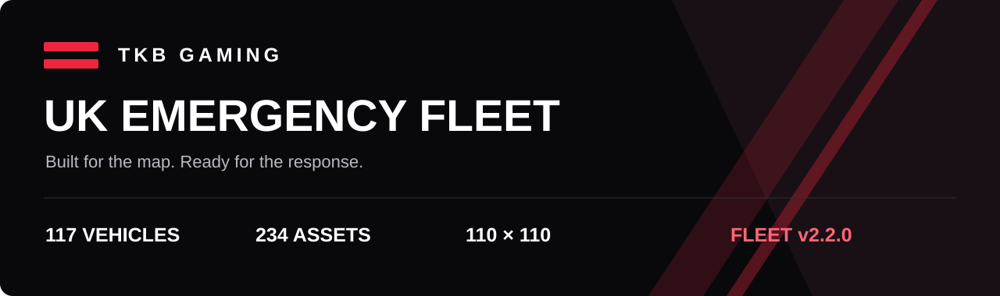

<strong>Original UK emergency vehicle graphics by Conroy1988 · TKB Gaming</strong> Compact sprites. Clear response lighting. One consistent perspective.

<a href="https://www.missionchief.co.uk/vehicle_graphics/5897"><strong>USE THE PACK</strong></a> &nbsp; / &nbsp; <a href="GALLERY.md"><strong>VIEW THE FLEET</strong></a> &nbsp; / &nbsp; <a href="https://github.com/Conroy1988/missionchief-uk-animated-graphics/releases/tag/v2.2.0"><strong>DOWNLOAD</strong></a> &nbsp; / &nbsp; <a href="docs/INSTALLATION.md"><strong>INSTALL GUIDE</strong></a>

---

## Your fleet, at a glance

The **live pack was updated on 24 September 2026** and contains **120 vehicles / 240 images**, including Coastguard Drone Unit, Lifeguard Quadbike and Lifeguard 4x4. Every slot has a normal PNG and an animated response APNG. The live pack is newer than the archived v2.2.0 GitHub release.

| Coverage | Format | Animation | In-game pack |
| :--- | :--- | :--- | :--- |
| **120 vehicles / 240 files** | **110×110**, transparent | **8 helicopter frames / 2 other frames** | **5897** |

<table><tr>
<td align="center"> <b>FIRE</b></td>
<td align="center"> <b>AMBULANCE</b></td>
<td align="center"> <b>POLICE</b></td>
<td align="center"> <b>AIR SUPPORT</b></td>
<td align="center"> <b>MARINE</b></td>
</tr></table>

**Fire · Ambulance · Police · Coastguard · Lifeboat · Search & Rescue · Recovery · Airfield · EOD**

## Start here

**Playing MissionChief?** Open [TKB UK Fleet — Animated](https://www.missionchief.co.uk/vehicle_graphics/5897), select the pack and enable animated vehicle graphics in the game. No extension or userscript is required.

**Browsing the current artwork?** Use the [live 120-vehicle gallery](GALLERY.md). The interactive gallery and repository-owned exports still show the older 117-vehicle v2.2.0 release; they do not yet represent the complete live update.

**Archiving the older release?** Get the [v2.2.0 numbered upload ZIP](https://github.com/Conroy1988/missionchief-uk-animated-graphics/releases/download/v2.2.0/TKB-UK-Emergency-Fleet-Direction-Neutral-MissionChief-Numbered-Upload-Ready-v2.2.0.zip). It contains the older 117-vehicle fleet, not the current 120-vehicle update. For the latest graphics, use the live pack or current gallery links. See [installation and troubleshooting](docs/INSTALLATION.md).

## Current live specification

- **120 slots:** all have a normal PNG and response APNG on a transparent 110×110 canvas.
- **Four helicopters:** eight-frame main- and tail-rotor animations, fixed hubs and flashing beacons; 65 ms per frame.
- **Other 116 vehicles:** two-frame response animations; 260 ms per frame.
- **Complete combinations:** pods sit on carrier vehicles; trailers include connected towing vehicles.
- **New units:** Coastguard Drone Unit, Lifeguard Quadbike and Lifeguard 4x4.

These details come from the live pack description and its 120 image pairs, checked on 24 September 2026. [Current pack record](data/live-pack-status.json).

## GitHub release status

**v2.2.0 is the latest published GitHub download, but it is no longer the live fleet baseline.** Its 117-vehicle source, previews and QA reports remain available as historical release evidence. Its 82.9% frame reduction and 82.6% byte reduction refer to that older release compared with v2.1.1, not the September live update.

The latest 120-vehicle source ZIP has not been published in this repository. Do not use the older ZIP expecting all current vehicles or the updated helicopter animation.

## Project library

| Looking for | Go to |
| :--- | :--- |
| All 120 live vehicle image pairs | [Current gallery](GALLERY.md) |
| Setup, downloads and troubleshooting | [Installation](docs/INSTALLATION.md) |
| Current release and previous milestones | [Changelog](CHANGELOG.md) |
| Design, lighting, scale and technical evidence | [Fleet technical overview](docs/FLEET_TECHNICAL_OVERVIEW.md) |
| Build, gallery preview and validation | [Development guide](docs/DEVELOPMENT.md) |
| Current status and future maintenance | [Roadmap](docs/ROADMAP.md) |
| Report a problem or suggest a vehicle | [Contributing](CONTRIBUTING.md) |
| Asset and code reuse | [Licence](LICENSE.md) |

## More from TKB

[MissionChief UK Guide](https://tkb-gaming.scot/games/missionchief/guides/) · [TKB scripts and tools](https://tkb-gaming.scot/mission-chief-scripts/) · [TKB Gaming](https://tkb-gaming.scot/)

The companion [V5 mission-marker pack](https://www.missionchief.co.uk/mission_graphics/539) contains 884 mission rows with service letters and priority numbers. It is a separate pack from these vehicle graphics and can be used alongside them.

---

**Created and maintained by [Conroy1988](https://github.com/Conroy1988).** Code: MIT. Artwork: CC BY-NC-SA 4.0; see [licence and attribution](LICENSE.md). This independent project is not affiliated with MissionChief, UK emergency services or vehicle manufacturers.
