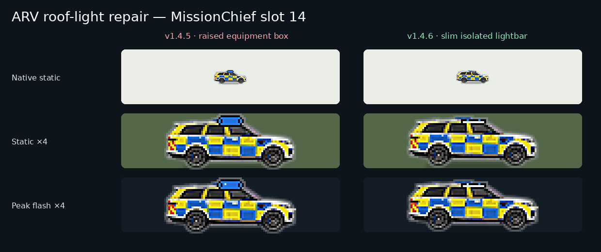
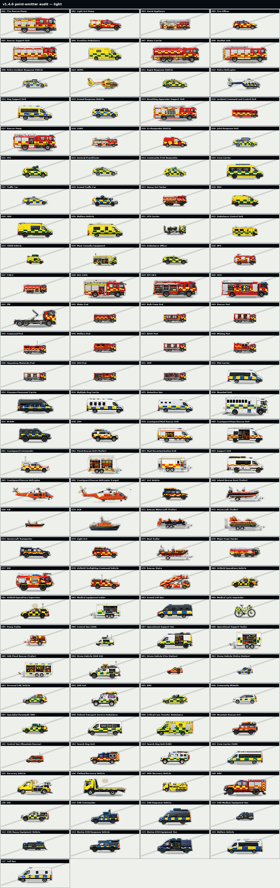

# TKB UK Emergency Fleet — Animated v1.4.6

A complete, original UK emergency-services vehicle graphics pack for [MissionChief UK](https://www.missionchief.co.uk/), built by **TKB Gaming**.

> **[Use TKB UK Fleet — Animated on MissionChief →](https://www.missionchief.co.uk/vehicle_graphics/5897)**

**[Open the interactive fleet gallery](https://tkb-gaming.scot/games/missionchief/guides/fleet-gallery/)** · **[Markdown gallery](GALLERY.md)** · **[See the automated map tests](#tested-for-real-map-conditions)** · **[MissionChief UK Guide](https://tkb-gaming.scot/games/missionchief/guides/)** · **[Scripts & Tools](https://tkb-gaming.scot/mission-chief-scripts/)**

## Preview the full fleet

<table>
  <tr>
    <td align="center" width="25%"><a href="GALLERY.md"></a><br><strong>Water Ladder</strong></td>
    <td align="center" width="25%"><a href="GALLERY.md"></a><br><strong>Ambulance</strong></td>
    <td align="center" width="25%"><a href="GALLERY.md"></a><br><strong>IRV</strong></td>
    <td align="center" width="25%"><a href="GALLERY.md"></a><br><strong>HEMS</strong></td>
  </tr>
  <tr>
    <td align="center" width="25%"><a href="GALLERY.md"></a><br><strong>Police helicopter</strong></td>
    <td align="center" width="25%"><a href="GALLERY.md"></a><br><strong>Coastguard Rescue Helicopter</strong></td>
    <td align="center" width="25%"><a href="GALLERY.md"></a><br><strong>Control Van (SAR)</strong></td>
    <td align="center" width="25%"><a href="GALLERY.md"></a><br><strong>EOD Heavy Equipment Vehicle</strong></td>
  </tr>
</table>

**[Explore all 117 graphics in the interactive map gallery →](https://tkb-gaming.scot/games/missionchief/guides/fleet-gallery/)**

Search by name, slot or role; filter by service and improvement type; switch static/APNG playback; test 100%, 75% and 50% scales on four map simulations; and compare stable releases side by side. The accessibility-first Markdown gallery remains available in [GALLERY.md](GALLERY.md).

## The complete UK fleet

Release **v1.4.6** covers every one of the **117 current vehicle slots** in MissionChief UK:

- 117 transparent, map-scale static PNGs
- A rebuilt Armed Response Vehicle roofline with the raised police-blue equipment box removed, replaced by one slim dark lightbar, two isolated blue lenses and two fixture-aligned independent flashes
- A rebuilt Rapid Response Vehicle roofline with the oversized green medical box and white cross removed, replaced by one slim dark lightbar, two isolated blue lenses and two fixture-aligned independent flashes
- A rebuilt Police Incident Response Vehicle roofline with one low-profile dark light housing, two separated one-pixel blue lenses and two fixture-aligned independent roof flashes instead of the former blue blobs
- 105 twelve-frame APNGs plus 12 carefully selected eighteen-frame aircraft, marine and visible-wheel animations, with a unique timing signature per vehicle
- Eighteen weaker ground assets redrawn with sharper compartment, panel, equipment, glazing and structural detail while preserving their exact map silhouettes
- Both operational lifeboats re-inked with clearer hull, tube, cabin, rail and navigation-fixture detail
- All four aircraft upgraded to 18-frame rotor, tail-rotor and aviation-light cycles with deeper multi-band rotor blur
- ILB and ALB upgraded to 18-frame vessel-specific bow spray, stern turbulence, waterline shimmer, wake length and fixture-aligned navigation lights
- Six suitable wheel-motion assets upgraded to smoother 18-frame rotation; ordinary road vehicles remain at 12 frames
- UK service colour families audited across fire, police, ambulance, Coastguard, lifeboat and search-and-rescue assets without adding protected logos or registrations
- Static/APNG bottom-centre anchoring verified across all 117 slots with zero canvas-anchor movement
- A fleet-wide **13 px per metre** scale calibration based on each vehicle's real length, with only 0.285% mean rounding error and the approved 169×84 ALB exception preserved
- 97 emergency assets distributed across 11 fleet phase offsets, 65 visible light-activity signatures and independent roof, grille, body and rear rhythms
- 604 active emergency-light coordinates audited across the standard and command profiles, including left-facing, specialist, carrier, wheel-motion and helicopter assets
- Seventeen specialist response vehicles retain vehicle-specific fixture coordinates so command screens, detector boards, drone cradles, medical markings, EOD equipment and tow gear never flash as emergency lamps
- Every active emergency-light emitter now uses one shared one-pixel point-lamp primitive; line, ellipse, rectangle, blur and synthetic glow operations are prohibited by CI
- All 234 animated APNGs retain full-canvas frame controls, while the exact 184 lit animations replace v1.4.2's elongated geometry
- Independent one-pixel roof, grille, body and rear lamps, plus subtle steady headlights and rear lamps on 91 response vehicles
- Semi-transparent elliptical main-rotor blur, aviation-light rhythms and moving haze on both preserved Coastguard tail rotors
- Improved red/green navigation lighting, bow spray, stern turbulence and class-weighted wakes for both operational lifeboats
- Selective wheel motion on six suitable cycle, ATV, recovery and airport assets, aligned to declared wheel geometry
- Twenty rebuilt role-specific masters with command, ANPR, medical, drone, CBRN and EOD equipment baked into the source artwork
- A standardised UK high-visibility colour pass across 123,797 livery pixels without introducing copied service marks
- Adaptive compact, standard and large-vehicle outlines that reduce the cut-out effect while retaining satellite-map contrast
- ALB map footprint reduced by approximately 30%, with both its static and eighteen-frame navigation/wake variants corrected
- Clean, original rooflines on the 40 vehicles affected by v1.2.0's artificial role and equipment overlays
- A fail-closed 40-asset roofline regression gate that rejects any return of generated top-padding blocks
- A coherent nine-vehicle mounted pod family across slots 42–50: Water, Bulk Foam, Rescue, Command, Welfare, BASU, Misting, Hazardous Materials and OSU
- Every pod role now retains its distinct module on a complete three-axle prime mover with visible cab, chassis, wheels and four-point response lighting
- The HVP at slot 51 now mounts its pump, hose banks and manifolds on the same complete prime-mover platform instead of appearing as a self-propelled module
- Complete, unclipped tail geometry on HEMS, Police and both Coastguard helicopters, protected by both clearance and structural-pixel regression gates
- Reinforced light/dark dual edges on the 15 weakest satellite-map assets; the minimum targeted satellite contrast remains above the v1.2 target
- Fleet-wide contact grounding shadows with five weight-appropriate classes for light vehicles, heavy vehicles, trailers, watercraft and aircraft
- Native half-scale sharpening and artefact cleanup across all 117 assets, with zero isolated alpha pixels remaining
- A full-fleet regression gate that decodes all 2,178 frames and rejects any response-light component above 2×2 pixels, elongated bars, boxes, partial APNG updates, off-silhouette blue pixels and hidden RGB in transparent pixels
- Fire, ambulance, police, coastguard, water rescue, HEMS, mountain rescue, airport, fire-investigation and EOD coverage
- The original v1.0 True Scale profile remains available and unchanged

Every release asset has passed the production validation suite for decoding, alpha transparency, slot order, unique IDs, relative scale, animation frame count, static/APNG alignment and expected flashing behaviour.

## Visual standard

The pack uses realistic right-facing side elevations, recognisable UK emergency-service colour language and a clean, consistent map presence. The artwork is original: it does not reproduce official service logos, vehicle registrations or third-party branding.

Emergency lighting is deliberately restrained so the fleet remains readable on a busy MissionChief map. Roof, grille, body and rear point lamps run independently, while 11 deterministic phase offsets and 65 activity patterns prevent an entire incident from blinking in lockstep.

## Tested for real map conditions

Every icon is tested automatically at **100%, 75% and 50% scale** against light, dark, grayscale and satellite-style backgrounds. The release gate checks half-zoom survival, edge contrast, corrected rooflines, frame stability and all 117 static/animated slot pairs.

[](assets/previews/v1.4.6/arv-roof-light-before-after.png)

[RRV roof-light repair retained from v1.4.5](assets/previews/v1.4.6/rrv-roof-light-before-after.png)

[IRV roof-light repair retained from v1.4.4](assets/previews/v1.4.6/irv-roof-light-before-after.png)

[](assets/previews/v1.4.6/full-fleet-lighting-light.png)

**[v1.4.2 bars versus v1.4.6 point lamps](assets/previews/v1.4.6/point-lamps-before-after.png)** · **[Dark-map full-fleet audit](assets/previews/v1.4.6/full-fleet-lighting-dark.png)** · **[Satellite full-fleet audit](assets/previews/v1.4.6/full-fleet-lighting-satellite.png)** · **[Grayscale full-fleet audit](assets/previews/v1.4.6/full-fleet-lighting-grayscale.png)** · **[18-frame aircraft audit](assets/previews/v1.4.6/aircraft-motion-18-frame-audit.png)** · **[18-frame marine audit](assets/previews/v1.4.6/marine-motion-18-frame-audit.png)** · **[Complete helicopter-tail audit](assets/previews/v1.4.6/complete-helicopter-tails-map-scale.png)**

## Install in MissionChief

1. Open the **[TKB UK Emergency Fleet — Animated](https://www.missionchief.co.uk/vehicle_graphics/5897)** pack.
2. Select the pack for your MissionChief account.
3. Enable animated vehicle graphics in MissionChief if you want the blue-light APNG versions.

For broader gameplay help, missions, vehicles, buildings and operational planning, visit the **[TKB MissionChief UK Guide](https://tkb-gaming.scot/games/missionchief/guides/)**.

For MissionChief enhancements and utilities, visit **[TKB MissionChief Scripts & Tools](https://tkb-gaming.scot/mission-chief-scripts/)**.

## Release downloads

The [v1.4.6 release](https://github.com/Conroy1988/missionchief-uk-animated-graphics/releases/tag/v1.4.6) includes:

- **`TKB-UK-Emergency-Fleet-Modern-Command-Clarity-MissionChief-Numbered-Upload-Ready-v1.4.6.zip`** — recommended ordered deployment package, with separate static and animated folders, an upload guide, manifest and reproducible SHA-256 verification
- **`TKB-MissionChief-UK-Graphics-Bulk-Uploader-v1.4.6.user.js`** — resumable live deployment helper for pack maintainers
- **`v1.4.6-build-report.json`**, **`v1.4.6-qa-report.json`**, **`v1.4.6-overhaul-report.json`**, **`v1.4.6-anchor-report.json`**, **`v1.4.6-full-fleet-lighting-report.json`** and **`v1.4.6-light-placement-report.json`** — machine-readable production evidence for every image and animation frame

The [v1.0.0 release](https://github.com/Conroy1988/missionchief-uk-animated-graphics/releases/tag/v1.0.0) remains available for players who prefer strict real-world relative scale.

## Repository structure

- `assets/sources/` — representative full-resolution chroma-key source artwork
- `assets/exports/standard/static/` — MissionChief-ready transparent PNGs
- `assets/exports/standard/animated/` — MissionChief-ready six-frame APNGs
- `assets/exports/command/static/` — v1.4.6 Modern Command Clarity PNGs
- `assets/exports/command/animated/` — v1.4.6 twelve- and eighteen-frame APNGs
- `assets/masters/` — deterministic command-profile replacement masters, including v1.2.4 carriers/full-tail aircraft, twenty baked v1.3.0 role masters and twenty v1.4.0 redraw/marine masters
- `assets/previews/` — map-scale, animation-frame and selected-artwork QA sheets
- `gallery/` — interactive gallery source, deterministic 117-vehicle catalogue and responsive browser client
- `data/vehicle-slots.json` — authoritative 117-slot MissionChief mapping
- `data/prototypes.json` — production specification and light-placement manifest
- `data/final-pack-validation.json` — release-level validation report
- `scripts/` — repeatable preparation, packaging and QA tools
- `docs/` — production standards, release checkpoints and the parked future roadmap

Large production artwork is supplied through the release archive rather than duplicated throughout Git history.

## Rebuild and validate

```bash
python scripts/build_mounted_pod_carriers.py --check
python scripts/build_helicopter_tail_masters.py --check
python scripts/build_v1_3_masters.py --check
python scripts/build_v1_4_masters.py --check
python scripts/validate_point_emitters.py
python scripts/build_v1_1_enhanced.py
python scripts/validate_irv_lighting.py
python scripts/validate_rrv_lighting.py
python scripts/validate_arv_lighting.py
python scripts/build_prototypes.py
python scripts/validate_v1_1_enhanced.py
python scripts/validate_v1_4_overhaul.py
python scripts/validate_full_fleet_lighting.py
python scripts/validate_release_scope.py
python scripts/validate_light_placement.py --report data/v1.4.6-light-placement-report.json
python scripts/build_numbered_upload_package.py --version v1.4.6 --profile command
python scripts/build_interactive_gallery.py --check --site-output dist/gallery-site
node --test tests/gallery.test.mjs
```

The final validation gate must report `"all_passed": true` before a release is published. The immutable v1.0 source profile remains documented separately in its release and checkpoint.

## Rights and licence

The artwork is original and the pack is not affiliated with or endorsed by MissionChief, any UK emergency service or any vehicle manufacturer.

Code and automation are MIT licensed. Artwork and visual assets are licensed under CC BY-NC-SA 4.0. See [LICENSE.md](LICENSE.md) for the exact scope and attribution requirement.
