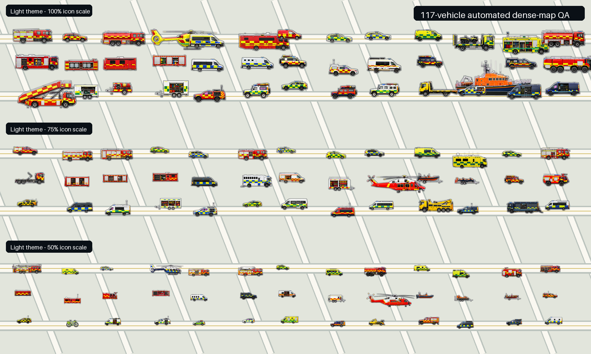

# TKB UK Emergency Fleet — Animated v1.1

A complete, original UK emergency-services vehicle graphics pack for [MissionChief UK](https://www.missionchief.co.uk/), built by **TKB Gaming**.

> **[Use TKB UK Fleet — Animated on MissionChief →](https://www.missionchief.co.uk/vehicle_graphics/5897)**

**[Preview all 117 vehicle graphics](GALLERY.md)** · **[See the automated map tests](#tested-for-real-map-conditions)** · **[MissionChief UK Guide](https://tkb-gaming.scot/games/missionchief/guides/)** · **[Scripts & Tools](https://tkb-gaming.scot/mission-chief-scripts/)**

## Preview the full fleet

<table>
  <tr>
    <td align="center" width="25%"><a href="GALLERY.md"></a><br><strong>Water Ladder</strong></td>
    <td align="center" width="25%"><a href="GALLERY.md"></a><br><strong>Ambulance</strong></td>
    <td align="center" width="25%"><a href="GALLERY.md"></a><br><strong>IRV</strong></td>
    <td align="center" width="25%"><a href="GALLERY.md"></a><br><strong>HEMS</strong></td>
  </tr>
  <tr>
    <td align="center" width="25%"><a href="GALLERY.md"></a><br><strong>Police helicopter</strong></td>
    <td align="center" width="25%"><a href="GALLERY.md"></a><br><strong>Coastguard Rescue Helicopter</strong></td>
    <td align="center" width="25%"><a href="GALLERY.md"></a><br><strong>Control Van (SAR)</strong></td>
    <td align="center" width="25%"><a href="GALLERY.md"></a><br><strong>EOD Heavy Equipment Vehicle</strong></td>
  </tr>
</table>

**[Explore all 117 static and animated vehicle graphics →](GALLERY.md)**

## The complete UK fleet

Release **v1.1.1** covers every one of the **117 current vehicle slots** in MissionChief UK:

- 117 transparent, map-scale static PNGs
- 117 twelve-frame APNGs with a unique timing signature per vehicle
- 87 emergency assets with independent roof, grille, body and rear blue-light rhythms
- Per-aircraft main-rotor alignment on all four helicopters, with the old static-under-moving blade artefact removed
- Animated external tail rotors on both coastguard helicopter variants; HEMS and police fenestrons retain their correct enclosed appearance
- Appropriate amber, wheel, navigation, wake and marker-light movement on 19 non-blue-light assets
- Command Visibility sizing and dual-tone map edges across the complete fleet
- Stronger visual separation for 33 specialist and rare assets
- Fire, ambulance, police, coastguard, water rescue, HEMS, mountain rescue, airport, fire-investigation and EOD coverage
- The original v1.0 True Scale profile remains available and unchanged

Every release asset has passed the production validation suite for decoding, alpha transparency, slot order, unique IDs, relative scale, animation frame count, static/APNG alignment and expected flashing behaviour.

## Visual standard

The pack uses realistic right-facing side elevations, recognisable UK emergency-service colour language and a clean, consistent map presence. The artwork is original: it does not reproduce official service logos, vehicle registrations or third-party branding.

Emergency lighting is deliberately restrained so the fleet remains readable on a busy MissionChief map. Lightbar, grille and rear elements now run independently, and per-vehicle cadence variation prevents an entire incident from blinking in lockstep.

## Tested for real map conditions

Every icon is tested automatically at **100%, 75% and 50% scale** against light, dark, grayscale and satellite-style backgrounds. The release gate checks half-zoom survival, edge contrast, specialist silhouette separation, frame stability and all 117 static/animated slot pairs.

[](assets/previews/v1.1/busy-map-light.png)

**[Dark-map test](assets/previews/v1.1/busy-map-dark.png)** · **[Satellite-style test](assets/previews/v1.1/busy-map-satellite.png)** · **[Animation frame audit](assets/previews/v1.1/animation-frames.png)** · **[Helicopter rotor audit](assets/previews/v1.1/helicopter-rotor-frames.png)**

## Install in MissionChief

1. Open the **[TKB UK Emergency Fleet — Animated](https://www.missionchief.co.uk/vehicle_graphics/5897)** pack.
2. Select the pack for your MissionChief account.
3. Enable animated vehicle graphics in MissionChief if you want the blue-light APNG versions.

For broader gameplay help, missions, vehicles, buildings and operational planning, visit the **[TKB MissionChief UK Guide](https://tkb-gaming.scot/games/missionchief/guides/)**.

For MissionChief enhancements and utilities, visit **[TKB MissionChief Scripts & Tools](https://tkb-gaming.scot/mission-chief-scripts/)**.

## Release downloads

The [v1.1.1 release](https://github.com/Conroy1988/missionchief-uk-animated-graphics/releases/tag/v1.1.1) includes:

- **`TKB-UK-Emergency-Fleet-Modern-Command-Visibility-MissionChief-Numbered-Upload-Ready-v1.1.1.zip`** — recommended ordered deployment package, with separate static and animated folders, an upload guide, manifest and SHA-256 verification
- **`TKB-MissionChief-UK-Graphics-Bulk-Uploader-v1.1.1.user.js`** — resumable live deployment helper for pack maintainers
- **`v1.1-build-report.json`** and **`v1.1-qa-report.json`** — machine-readable production evidence

The [v1.0.0 release](https://github.com/Conroy1988/missionchief-uk-animated-graphics/releases/tag/v1.0.0) remains available for players who prefer strict real-world relative scale.

## Repository structure

- `assets/sources/` — representative full-resolution chroma-key source artwork
- `assets/exports/standard/static/` — MissionChief-ready transparent PNGs
- `assets/exports/standard/animated/` — MissionChief-ready six-frame APNGs
- `assets/exports/command/static/` — v1.1 Modern Command Visibility PNGs
- `assets/exports/command/animated/` — v1.1 twelve-frame APNGs
- `assets/masters/v1.1/` — new high-resolution v1.1 replacement source masters
- `assets/previews/` — map-scale, animation-frame and selected-artwork QA sheets
- `data/vehicle-slots.json` — authoritative 117-slot MissionChief mapping
- `data/prototypes.json` — production specification and light-placement manifest
- `data/final-pack-validation.json` — release-level validation report
- `scripts/` — repeatable preparation, packaging and QA tools
- `docs/` — production standards and release checkpoints

Large production artwork is supplied through the release archive rather than duplicated throughout Git history.

## Rebuild and validate

```bash
python scripts/build_v1_1_enhanced.py
python scripts/validate_v1_1_enhanced.py
python scripts/build_numbered_upload_package.py --version v1.1.1 --profile command
```

The final validation gate must report `"all_passed": true` before a release is published. The immutable v1.0 source profile remains documented separately in its release and checkpoint.

## Rights and licence

The artwork is original and the pack is not affiliated with or endorsed by MissionChief, any UK emergency service or any vehicle manufacturer.

Code and automation are MIT licensed. Artwork and visual assets are licensed under CC BY-NC-SA 4.0. See [LICENSE.md](LICENSE.md) for the exact scope and attribution requirement.
